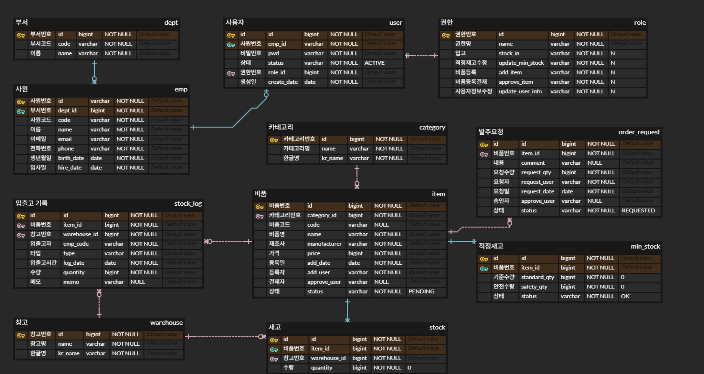

# 🎯 BQ System
비품 재고를 효율적으로 관리하기 위한 통합 시스템입니다.  
웹(React)과 모바일(Android)을 함께 개발하고, Spring Boot 백엔드로 데이터를 통합 관리했습니다.

---

## 💡 프로젝트 개요
비품의 등록부터 입출고, 최소 재고 감지, 발주 요청까지 한 번에 처리할 수 있도록 설계했습니다.  
QR 코드 기반 입출고 기능을 통해 관리 효율을 높였고,  
웹과 앱 간 데이터 동기화를 직접 구현했습니다.

---

## ⚡ 개발 기간
2025.09.15 ~ 2025.10.15

---

## 🛠 기술 스택
- **Back-end** : Java 17 · Spring Boot · JPA · MySQL  
- **Front-end** : React (Vite) · Zustand · AG-Grid  
- **Android** : Kotlin · Retrofit2 · ZXing (QR)  
- **Tools** : IntelliJ · Android Studio · VS Code · GitHub · SourceTree  

---

## 🧩 담당 역할
- **Back-end & Web & Android Integration**  
  - Spring Boot 기반 API 설계 및 데이터베이스 모델링  
  - React 관리자 페이지 구현 및 프론트–서버 데이터 연동  
  - Android 입출고 처리 및 Retrofit 통신  
  - QR 기반 입출고 기능 설계 및 트랜잭션 처리  

---

## 🧱 ERD

---

## 💭 프로젝트를 통해 배운 점
웹과 앱을 동시에 개발하며, 클라이언트–서버 간 통신 구조를 깊이 이해할 수 있었습니다.  
API 명세와 데이터 구조를 직접 정의하면서 RESTful 설계의 중요성을 체감했고,  
QR 기능을 통해 트랜잭션 처리와 예외 케이스 대응 방식을 경험적으로 익혔습니다.
